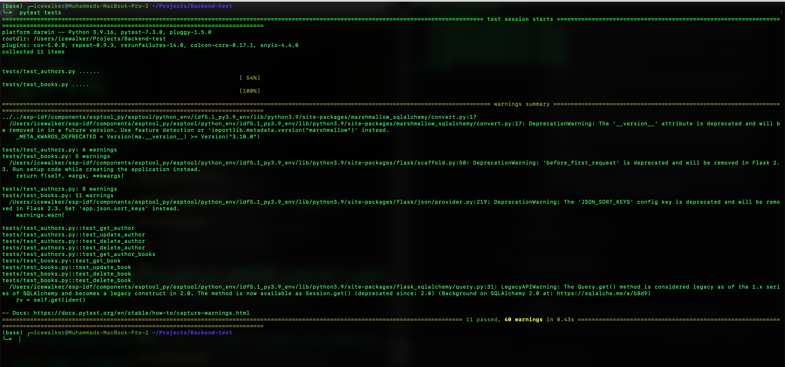

# Project Title
Backend test challenge.
## Description
This program is made for fullfil test challenge for Backend Developer qualification.
## Getting Started
### Dependencies
* Python 3.9.16
* Git CLI
### Installing dependencies
```
pip install -r requirements.txt
 ```

### Executing program
* Starting the Flask server
```
python run.py
```
* Run the tests
``` 
pytest tests/
```

## Tech Stack Reason

1. Why ``python`` ? Because python is lightweight and high perfomance program and simple language to be used. Since python is interpreter, it enables i am to code "perfectly" so errors or bugs can be minimized.
2. Why ``Flask`` ? Flask is like Node.JS/Express in Javascript, it's simple server framework tools. Easy to configure.
3. ``Werkzeug`` : Web Server Gateway Interface that includes query args, form data, cache control, cookies, files and stack traces with interpreter to traceback the error.
4. ``marshmallow-sqlalchemy`` : Driver for SQLAlchemy
5. ``SQLAlchemy`` : ORM (Object-Relational Mapping) Utils that provides custom data types and various utility function.
6. ``Psycopg`` : Postgresql database driver for python. Its main features are the complete implementation of the Python DB API 2.0 specification and the thread safety.
7. ``Flask-Caching``: Caching plugin for flask
8. ``flask-profiler``: For profiling API performance. It can be accessed from ``http://127.0.0.1:5000/flask-profiler/`` and use credentials by default is ``Username: admin`` ``Password:admin``


## Test Results



## Authors
Muhammad Reza Maulana  
[mrezzaaa](https://linkedin.com/in/mrezzaaa)
## Version History
* 0.1


## License
This project is licensed under the Muhammad Reza Maulana License.
